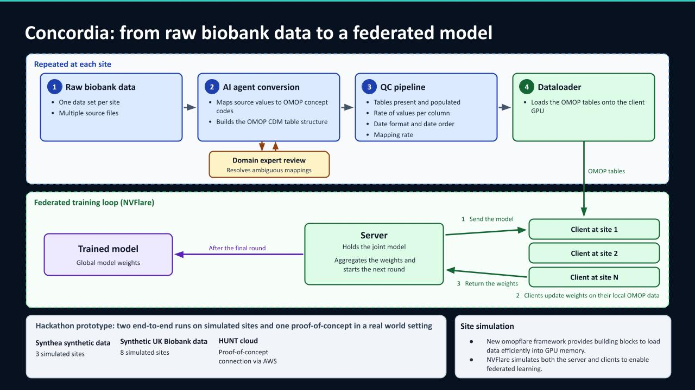
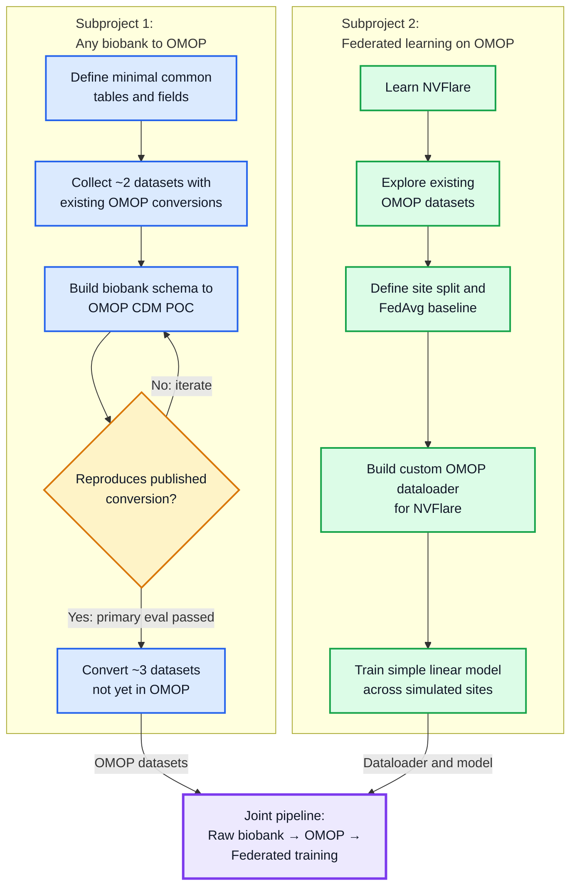

# Concordia

**The bottleneck was never the learning.** Automated biobank-to-OMOP harmonisation for federated analysis.

*Project 5 at the Nordic Biobank × NVIDIA Federated Learning Hackathon, Copenhagen 2026*

**ETL pipeline and federated learning framework for OMOP Common Data Model data.**

Convert a biobank dataset to OMOP, validate it, and run federated learning across sites — 
all in one reproducible pipeline.

Federated learning has worked for years. It still almost never happens.
The learning is solved: NVFlare, FedAvg, secure aggregation. The data is not. Every biobank stores it differently, and a hand-built ETL per source takes months.
We automated that step. Raw biobank data in, harmonised OMOP out, quality controlled, trained across sites. Nothing leaves the institution.
Collaboration stops being a technical problem. It becomes a choice.

## Quickstart

Subproject 1, raw Synthea data of one site to OMOP, then checked against the contract:

```bash
pip install -r omop_skill/requirements.txt
python omop_skill/scripts/run_mapping.py --mapping omop_skill/mappings/synthea_3.3.0.yaml --source synthea_cohorts/cohort_2/data/source_compact/site_a --out omop_skill/output/site_a
python omop_skill/scripts/validate_contract.py omop_skill/output/site_a --contract omop_skill/contract_rev1.yaml
```

Subproject 2, federated training over the five sites of `cohort_2`:

```bash
pip install -e .
python examples/omop_t2dm/run.py --sites synthea_cohorts/cohort_2/data/omop
```

A full NVFlare job is in [`src/omopflare/README.md`](src/omopflare/README.md).

## How it works



At every site:

1. **Raw biobank data.** One data set per site, several source files.
2. **AI agent conversion.** An agent profiles the raw files and writes the mapping, a YAML recipe that builds the OMOP tables. A domain expert approves ambiguous mappings; the AI only proposes. Instructions for any agent: [`omop_skill/SKILL.md`](omop_skill/SKILL.md).
3. **QC gate.** Contract, missingness, dates, units, mapping rate.
4. **Dataloader.** Streams the four OMOP tables to the client GPU with [`omopflare`](src/omopflare/README.md).

NVFlare then runs the federated loop. The server sends the model, every client trains on its own OMOP tables and returns only its weights, and the server aggregates them for the next round.
The only thing that crosses a boundary is a weight vector.

The hackathon prototype runs end to end on simulated sites twice, on Synthea and on synthetic UK Biobank data (eight assessment centres), and connects to HUNT Cloud over AWS as a proof of concept.

<details>
<summary>The plan from day one</summary>



</details>

The project page [`docs/index.html`](docs/index.html) has the interactive figures; open it in a browser.

## Results

### An agent wrote the mapping, and it matches the expert ETL

| | |
| --- | --- |
| Blind run | A fresh Synthea 3.3.0 run, 1,162 patients. The mapping was written from the data contract and a profile of the raw files, not from an OMOP output to copy. |
| Against OHDSI ETL-Synthea | 254,882 of 254,891 measurement values identical. 0 differences in diagnoses, on every start date. 11 person rows differ, and there the contract is right: it maps a race that ETL-Synthea leaves at 0. |
| Speed | 8 seconds for 2.1 GB of raw data, no database server. |
| Common model | OMOP CDM 5.4, four tables, 22 concepts, every concept ID checked against the Athena vocabulary v5.0 29-AUG-26. |
| UK Biobank | The same skill maps the raw UKB extract with [`ukb_pilot.yaml`](omop_skill/mappings/ukb_pilot.yaml). All eight sites pass contract validation. |

QC caught what both conversions let through: nine LDL values below zero, and HbA1c with a median of 3.9 %.
Method and all numbers: [`omop_skill/RESULTS.md`](omop_skill/RESULTS.md).

### QC answers the question before the model does

Federation pays off only when the sites differ.

| | Synthea | UK Biobank |
| --- | --- | --- |
| Case rate across sites | 7.0× | 1.6× |
| Worst site vs. pooled | 0.79 SD | 0.03 SD |
| Span of site BMI medians | 4.90 | 0.28 |
| Systolic BP in the plausible range | 100 % | 94 % |

Eight centres within 0.03 SD of the pooled mean are eight copies of one cohort. One cohort has something to federate, the other does not, and the figures say so before anyone trains.

### Federation recovers what fragmentation costs


One real cohort of 964 patients, split across 1 to 16 sites.
Alone, a site falls from 0.87 to 0.77. Federated, it holds at 0.87 to 0.92, level with pooled. Nobody shared a row.

**Five Synthea sites that differ** ([details](examples/synthea_diabetes/README.md)): federated AUROC 0.582 against 0.586 pooled, while the smallest site alone scores 0.433, worse than chance. With 23 held-out cases the intervals overlap; they support federated matching pooled, not a significant pairwise gap.

**UK Biobank, the negative control** ([details](examples/ukb_diabetes/README.md)): 40,671 people in eight centres, 198 incident cases. The synthetic fields are drawn independently, so no model beats chance, and none does. Single sites still show apparent signal, 0.430 to 0.575, while federated scores 0.511.

**At scale:** 1,000,000 patients and 3.39 billion rows. Scan 7.9 s, feature matrix 7.7 s, one epoch 1.1 s, 6.2 GB of memory. A real NVFlare job with three clients takes 42 s for five rounds.


### Slides

- [`presentation/concordia_final_slides.pdf`](presentation/concordia_final_slides.pdf): final presentation, six slides plus appendix
- [`presentation/concordia_slides.pdf`](presentation/concordia_slides.pdf): earlier LaTeX deck
- [`presentation/midterm_slides.pdf`](presentation/midterm_slides.pdf): midterm presentation
- [`presentation/Method_slides.pdf`](presentation/Method_slides.pdf): methods

## Repository

| Path | What |
| --- | --- |
| [`omop_skill/`](omop_skill/README.md) | Subproject 1: turns raw source data into the contract's OMOP tables and checks them. Route A: YAML mapping (Synthea). Route B: vocabulary review with human approval (UK Biobank). |
| [`omop_skill/SKILL.md`](omop_skill/SKILL.md), [`AGENTS.md`](AGENTS.md) | Instructions for any AI agent. Claude Code finds the skill through `.claude/skills/omop-etl/`. |
| [`omop_skill/review/`](omop_skill/review/README.md) | Route B for UK Biobank: Athena proposals, human approval, visual QC |
| [`src/omopflare/`](src/omopflare/README.md) | Subproject 2: OMOP features for federated learning with NVFlare |
| [`examples/ukb_diabetes/`](examples/ukb_diabetes/README.md) | Raw UK Biobank to OMOP to federated diabetes risk, end to end |
| [`examples/synthea_diabetes/`](examples/synthea_diabetes/README.md) | The same pipeline on a cohort that has signal |
| `examples/` | `omop_t2dm` (federated type 2 diabetes risk), benchmarks and their figures, NVFlare samples, earlier demos |
| `synthea_cohorts/` | Synthetic cohorts, one folder per generation method |
| [`contract/`](contract/data_contract.md) | The data contract both subprojects hand over on |
| `presentation/`, `docs/` | Slides and project page |
| [`plan.md`](plan.md), [`Development_Journey.md`](Development_Journey.md) | The plan, and how the project got here |

## Limits

Proof of concept. The Synthea and UK Biobank data are synthetic, the sites are simulated, and the federated benchmark uses one real cohort.

Not yet:

- Proven on a source family beyond Synthea and UK Biobank.
- Looking up concepts on its own. The IDs come from the contract, checked against Athena once, by a person.
- More than four tables. No vocabulary tables, visits, drugs or procedures.
- Running unattended. An AI drafts every mapping; a person approves every mapping.

Next: HUNT Cloud over AWS, real infrastructure and a real institutional boundary.

## Members

charles, solvi, lukas, maria, max, nik, mia, kev
