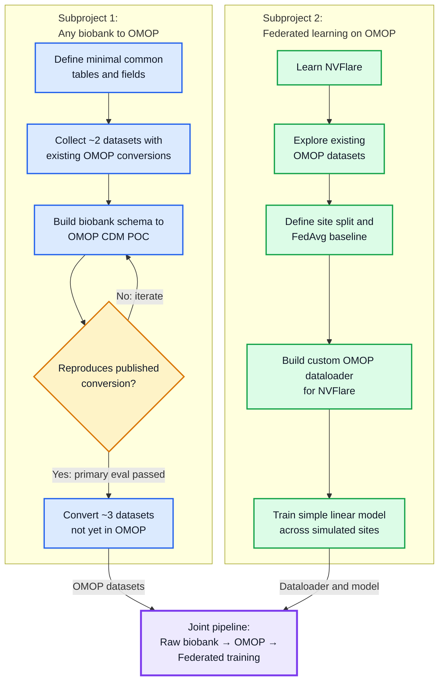
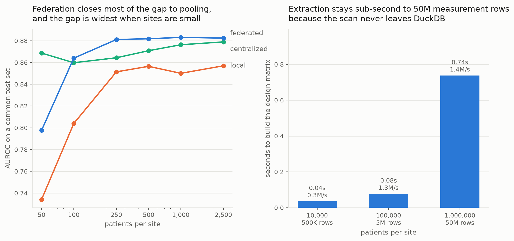
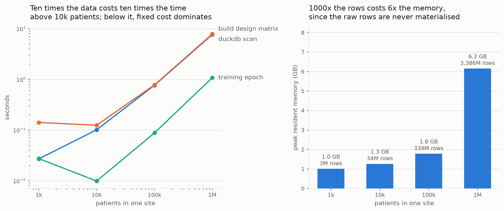

# Project 5: Everything OMOP

**ETL pipeline and federated learning framework for OMOP Common Data Model data.**

Convert a biobank dataset to OMOP, validate it, and run federated learning across sites — 
all in one reproducible pipeline.

Federated learning across biobanks has been technically possible for years, and it almost never happens.
The data is messy, and there is no common model.

We automated that step.
Raw data in, harmonised OMOP out, quality controlled, then trained across sites without a record leaving its institution.
The barrier to collaboration stops being technical and becomes a decision.



**Subproject 1** gets any biobank dataset into OMOP. **Subproject 2** runs federated learning over the result.
The project page [`docs/index.html`](docs/index.html) has the interactive figures; open it in a browser.

## Results

### Subproject 1: raw data to OMOP

| | |
| --- | --- |
| Common model | OMOP CDM 5.4, four tables, 22 concepts. Every concept ID checked against the Athena vocabulary v5.0 29-AUG-26. |
| Blind test | A fresh Synthea 3.3.0 run with 1,162 patients. The mapping was written from the data contract and a profile of the raw data, without looking at any existing OMOP output. |
| Against OHDSI ETL-Synthea | 254,882 of 254,891 measurement values identical. Every diagnosis identical. Persons identical except race for 11 patients, a race the contract maps and ETL-Synthea leaves at 0. |
| Speed | 8 seconds for 2.1 GB of raw data, no database server. |
| Quality control | Contract check and QC report pass. The value analysis found what both conversions let through: Synthea's HbA1c has a median of 3.9 %, and 9 LDL values are negative. |
| UK Biobank | Synthetic UKB extract to OMOP with Athena proposals, human approval and visual QC in [`ukb_omop_agent`](ukb_omop_agent/README.md). |

Method and all numbers: [`omop_skill/RESULTS.md`](omop_skill/RESULTS.md).

### Subproject 2: federated learning on OMOP



One real cohort of 964 patients, split across 1 to 16 sites.
Local accuracy drops from 0.87 to 0.77 as the sites shrink. The federated model stays between 0.87 and 0.92, on par with training on the pooled data (0.85 to 0.88).



MIMIC's real row density, replicated up to 1 million patients and 3.4 billion measurement rows: scan 7.9 s, feature matrix 7.7 s, one training epoch 1.1 s, 6.2 GB of memory.
A real NVFlare job over the same cohort with three clients takes 42 seconds for five rounds.

### Slides

- [`presentation/OMOPFLARE.pdf`](presentation/OMOPFLARE.pdf): OMOPFLARE slides
- [`presentation/midterm_slides.pdf`](presentation/midterm_slides.pdf): midterm presentation
- [`presentation/Method_slides.pdf`](presentation/Method_slides.pdf): methods

## Repository

| Path | What |
| --- | --- |
| [`omop_skill/`](omop_skill/README.md) | Subproject 1: turns raw source data into the contract's OMOP tables. Profile, mapping, contract check, QC report, comparison with ETL-Synthea. |
| [`.claude/skills/omop-etl/`](.claude/skills/omop-etl/SKILL.md) | The skill instructions an AI agent follows |
| [`ukb_omop_agent/`](ukb_omop_agent/README.md) | UK Biobank to OMOP: Athena proposals, human approval, visual QC |
| [`src/omopflare/`](src/omopflare/README.md) | Subproject 2: OMOP features for federated learning with NVFlare |
| `examples/` | `omop_t2dm` (federated type 2 diabetes risk), benchmarks and their figures, NVFlare samples, earlier demos |
| `synthea_cohorts/` | Synthetic cohorts, one folder per generation method |
| [`contract/`](contract/data_contract.md) | The data contract both subprojects hand over on |
| `presentation/`, `docs/` | Slides and project page |
| [`plan.md`](plan.md), [`Development_Journey.md`](Development_Journey.md) | The plan, and how the project got here |

## Quickstart

Subproject 1, raw Synthea data of one site to OMOP, then checked against the contract:

```bash
pip install -r omop_skill/requirements.txt
python omop_skill/scripts/run_mapping.py --mapping omop_skill/mappings/synthea_3.3.0.yaml --source synthea_cohorts/cohort_2/data/source_compact/site_a --out omop_skill/output/site_a
python omop_skill/scripts/validate_contract.py omop_skill/output/site_a --contract omop_skill/contract_rev1.yaml
```

Subproject 2, federated training over the five sites of `cohort_2`:

```bash
pip install -e .
python examples/omop_t2dm/run.py --sites synthea_cohorts/cohort_2/data/omop
```

A full NVFlare job is in [`src/omopflare/README.md`](src/omopflare/README.md).

## Limits

Proof of concept.
The Synthea and UK Biobank data are synthetic and the sites are simulated. The federated benchmark uses one real cohort.
An AI drafts the mappings, a person approves them.

## Members

charles, solvi, lukas, maria, max, nik, mia, kev
