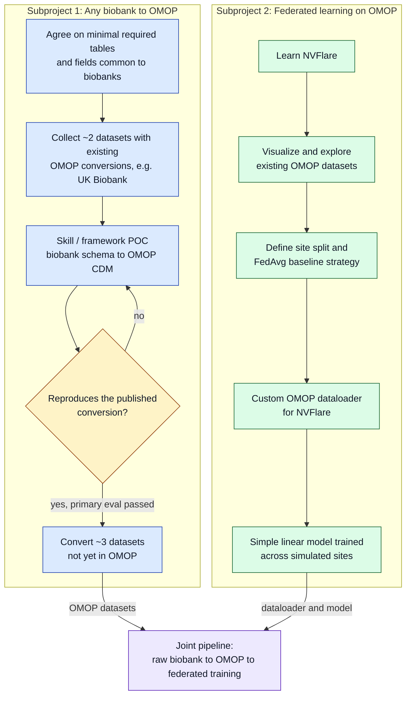

# Project 5: Everything OMOP

## Programming language

Python is the preferred language for code in this repo.

## Subproject 1: An automated way of getting biobank data into OMOP 

### Goal

Come up with a skill or framework/tool to get ANY biobank dataset into OMOP.

### Milestones

- Agree on the minimal required tables & information of any biobanks for both datasets.
- Find ±2 datasets that have already been transferred to OMOP such as the UK Biobank.
- Write a skill or framework POC that recreates the existing conversions on its own to reproduce the conversion. This serves as our primary evaluation.
- Find ±3 datasets that are not yet in OMOP. Transform these into OMOP. They will serve as the eventual input for sub project 2.

## Subproject 2: A proof of concept of federated learning applied to OMOP datasets

### Goal

Implement a federated learning POC for OMOP data. Might require a new dataloader.

### Milestones

- Learn NVFlare as our federated learning tool
- Visualize & explore existing OMOP datasets. Try to understand how to best apply federated learning to them.
- Implement a custom dataloader for federated learning and apply it to a simple linear model. The accuracy or scientific outcome doesn't matter.
- Create a pipeline that brings together subproject 1 & 2

### Members 
-charles
-solvi
-lukas
-maria
-max
-nik
-mia
-kev

