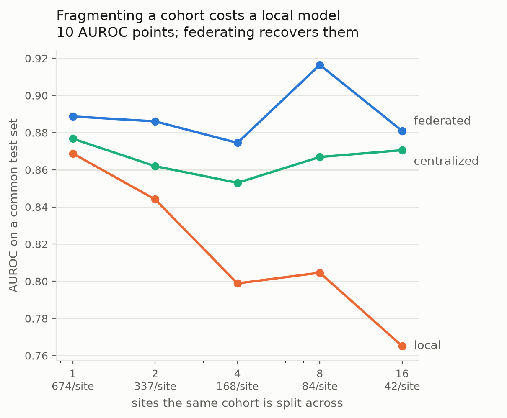
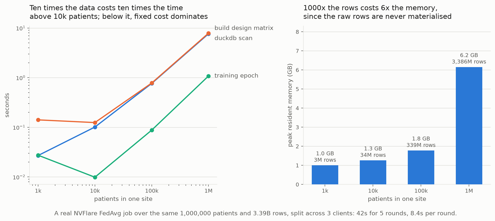
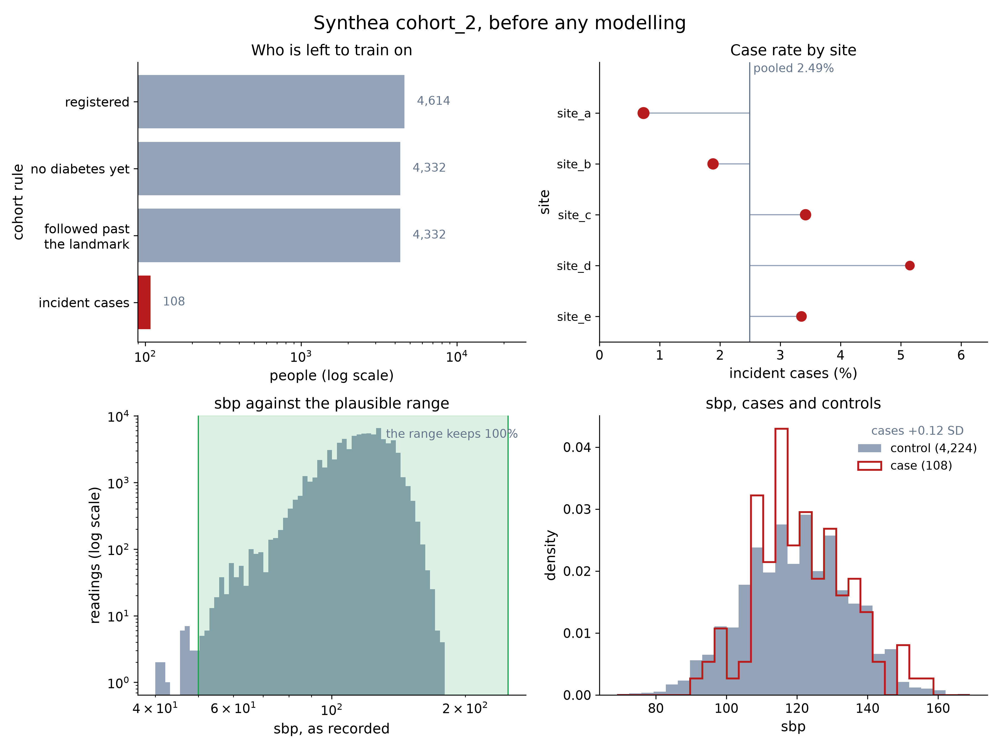
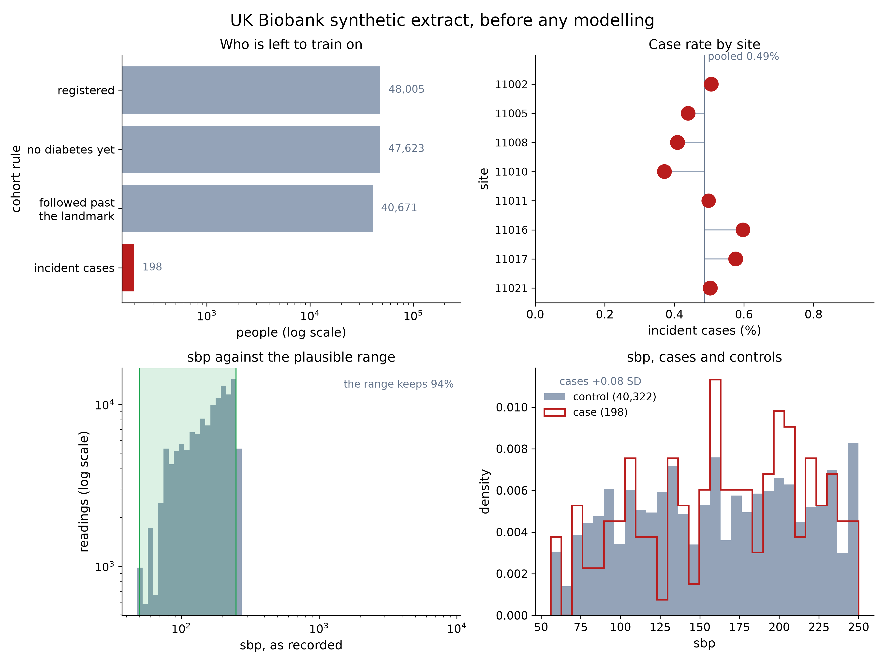
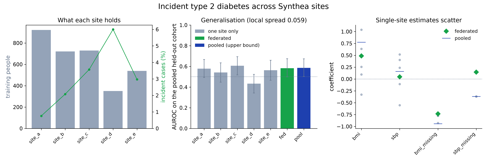
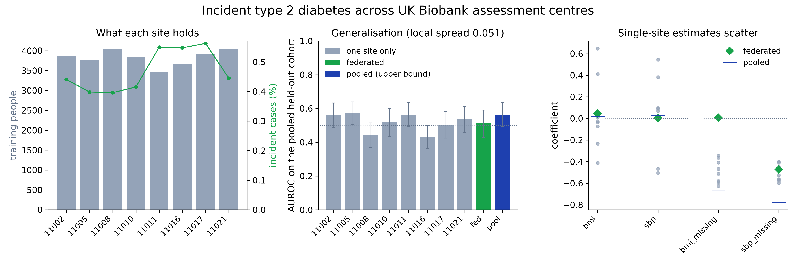

# Concordia

**The bottleneck was never the learning.** Automated biobank-to-OMOP harmonisation for federated analysis.

*Project 5 at the Nordic Biobank × NVIDIA Federated Learning Hackathon, Copenhagen 2026*

**ETL pipeline and federated learning framework for OMOP Common Data Model data.**

Outcome slides: https://docs.google.com/presentation/d/1I1nlIlsc0asSbRA2BaA1wkYWe8p0m3jS/edit?usp=sharing&ouid=114199228492846411451&rtpof=true&sd=true

Difficult terms are explained under [Terms](#terms).

## The problem

- Federated learning has worked for years: many institutions train one model together, and the data never leaves any of them.
- It still almost never happens.
- The blocker is not the learning, it is the data: every biobank stores it differently.
- Turning one source into a common format (an ETL) takes months of hand work, per source.
- **Concordia automates that step.** Raw biobank data in, harmonised OMOP out, quality controlled, trained across sites.
- Nothing leaves the institution. Collaboration stops being a technical problem and becomes a choice.

## How it works


At every site:

1. **Raw biobank data.** One data set per site, several source files.
2. **AI agent conversion.** The agent profiles the raw files and writes the mapping, a recipe for the OMOP tables. A domain expert approves it. The AI only proposes.
3. **QC gate.** Checks the four OMOP tables: columns, missing values, dates, codes, plausible values.
4. **Dataloader.** Streams the tables to the GPU with [`omopflare`](src/omopflare/README.md).

Across the sites:

- **NVFlare** runs the training rounds. The server sends the model, each site trains on its own data and returns only the weights, the server averages them.
- Only model weights cross an institutional boundary, never a patient record.
- Instructions for any coding agent: [`omop_skill/SKILL.md`](omop_skill/SKILL.md).

## Results

**The conversion**

- An agent wrote the mapping blind, from the contract and a profile of the raw data.
- Against OHDSI's own conversion (ETL-Synthea) on 1,162 patients: 254,882 of 254,891 measurement values identical, no difference in diagnoses.
- 8 seconds for 2.1 GB of raw data, no database server.
- QC caught what both conversions let through: negative LDL values, and an HbA1c median of 3.9 %.
- The same skill maps the raw UK Biobank extract. All eight assessment centres pass the contract.

**Federation pays off when data is fragmented**

<p>


</p>

- One real cohort of 964 patients, split across 1 to 16 sites.
- Alone, a site falls from 0.87 to 0.77 AUROC. Federated, it holds at 0.87 to 0.92, level with pooled training.
- It scales: 1 million patients and 3.39 billion rows, scanned in 7.9 s with 6.2 GB of memory.

**QC tells you before training whether federating is worth it**

<p>


</p>

- The five Synthea sites differ: the case rate varies 7-fold. Worth federating.
- The eight UK Biobank centres are copies of one cohort: all within 0.03 standard deviations of the pooled mean. Nothing to reconcile.

**Five Synthea sites: federated matches pooled**



- Federated AUROC 0.582 against 0.586 pooled.
- The smallest site alone scores 0.433, worse than chance.

**Eight UK Biobank centres: the negative control holds**



- The synthetic data has no signal, and no model finds one: every interval covers 0.5.
- Single sites still show apparent signal. Federation averages it out.

Details: [`omop_skill/RESULTS.md`](omop_skill/RESULTS.md), [`examples/synthea_diabetes`](examples/synthea_diabetes/README.md), [`examples/ukb_diabetes`](examples/ukb_diabetes/README.md), and the [final slides](presentation/concordia_final_slides.pdf).

## Quickstart

Subproject 1, raw Synthea data of one site to OMOP, then checked against the contract:

```bash
pip install -r omop_skill/requirements.txt
python omop_skill/scripts/run_mapping.py --mapping omop_skill/mappings/synthea_3.3.0.yaml --source synthea_cohorts/cohort_2/data/source_compact/site_a --out omop_skill/output/site_a
python omop_skill/scripts/validate_contract.py omop_skill/output/site_a --contract omop_skill/contract_rev1.yaml
```

Subproject 2, federated training over the five sites of `cohort_2`:

```bash
pip install -e .
python examples/omop_t2dm/run.py --sites synthea_cohorts/cohort_2/data/omop
```

A full NVFlare job is in [`src/omopflare/README.md`](src/omopflare/README.md).

## Repository

| Path | What |
| --- | --- |
| [`omop_skill/`](omop_skill/README.md) | Subproject 1: raw data to OMOP, and the checks |
| [`src/omopflare/`](src/omopflare/README.md) | Subproject 2: OMOP dataloader and federated learning with NVFlare |
| [`examples/`](examples/) | End-to-end runs (`ukb_diabetes`, `synthea_diabetes`) and the benchmarks |
| [`contract/`](contract/data_contract.md) | The data contract both subprojects hand over on |
| `synthea_cohorts/` | Synthetic cohorts |
| [`presentation/`](presentation/), [`docs/`](docs/index.html) | Slides and project page |

## Limits

- Proof of concept: synthetic data, simulated sites, one real cohort for the benchmark.
- An AI drafts every mapping, a person approves it.
- Next: HUNT Cloud over AWS, real infrastructure and a real institutional boundary.

## Terms

| Term | Meaning |
| --- | --- |
| Biobank | A research collection of health data, and often samples, from many people. |
| OMOP CDM | The Observational Medical Outcomes Partnership Common Data Model: one shared table layout and one set of standard codes for health data. The common language Concordia translates into. |
| OHDSI | Observational Health Data Sciences and Informatics, the open community behind OMOP and its tools. |
| ETL | Extract, transform, load: take data out of a source, convert it, and load it into the target format. |
| Harmonisation | Bringing differently stored data into the same structure and the same codes. |
| Mapping | The recipe that says which source field becomes which OMOP field, and which source code becomes which standard concept. |
| Concept ID | OMOP's number for one medical meaning, for example 3038553 for body mass index. |
| Athena | OHDSI's online dictionary of standard vocabularies, where concept IDs are looked up. |
| SNOMED, LOINC, ICD-10 | Coding systems: SNOMED and ICD-10 for diagnoses, LOINC for lab tests and measurements. |
| ETL-Synthea | OHDSI's hand-built, expert conversion of Synthea data into OMOP. Our reference. |
| Synthea | An open-source generator of realistic but invented patient records. |
| Synthetic UK Biobank | A public data set in the UK Biobank format with invented values, no real participants. |
| QC | Quality control: automatic checks for missing values, impossible dates, unknown codes and implausible values. |
| Data contract | The team's agreement on which tables, columns and codes the conversion delivers and the training reads. |
| Agent, skill | An AI assistant that runs commands, and the instruction file it follows. |
| Federated learning | Training one model across several sites while each site keeps its data. |
| NVFlare | NVIDIA's open-source framework for federated learning. |
| FedAvg | Federated averaging: in every round the server averages the model weights the sites send back. |
| Weights | The numbers a model learns. The only thing the sites share. |
| Pooled training | Training on all data in one place. The upper bound federated learning is measured against. |
| AUROC | Area under the ROC curve: how well a model separates cases from non-cases. 0.5 is chance, 1.0 is perfect. |
| Negative control | A test on data known to hold no signal, to show the method does not invent one. |
| Dataloader | The part that reads the OMOP tables and feeds them to the model in batches. |
| DuckDB | A small database engine that runs inside Python, without a server. |
| Standard deviation (SD) | How spread out values are. 0.03 SD from the mean means practically the same. |

## Members

charles, solvi, lukas, maria, max, nik, mia, kev
