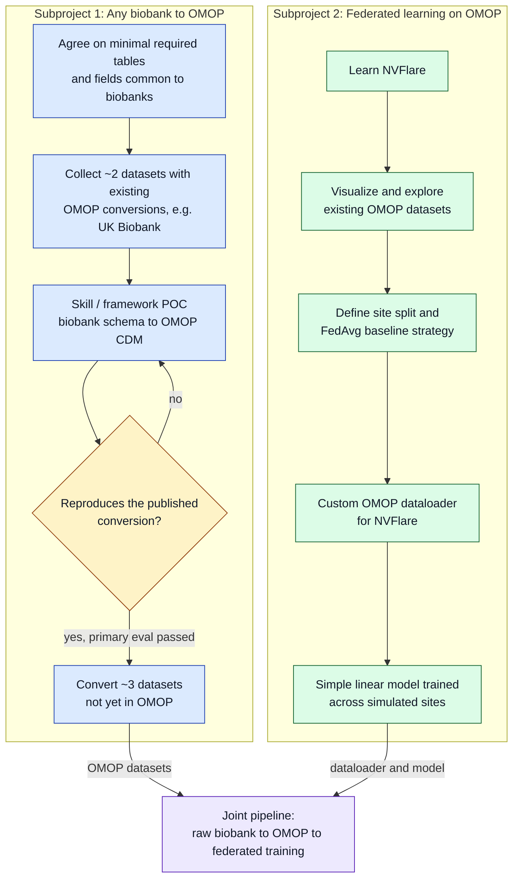

# Project 5: Everything OMOP



**Subproject 1** gets any biobank dataset into OMOP.
**Subproject 2** runs federated learning over the result.
The diagram above is the plan; `plan.md` has the schedule.

A one-page summary of the whole project is in [`docs/index.html`](docs/index.html); open it in a browser.

## Layout

| path | what |
| --- | --- |
| `src/omopflare` | the library: OMOP feature extraction for federated learning ([README](src/omopflare/README.md)) |
| `examples/omop_t2dm` | federated T2DM risk over any cohort's sites |
| `examples/` | NVFlare hello-world samples and earlier demos |
| `synthea_cohorts` | the cohorts, one folder per generation method |
| `contract` | the OMOP table contract the two subprojects hand over on |

## Quickstart

```bash
pip install -e .
python examples/omop_t2dm/run.py --sites synthea_cohorts/cohort_2/data/omop
```

```python
import omopflare as of

spec = of.FeatureSpec(
    features=(of.Feature("bmi", 3038553, "measurement", unit_concept_id=9531, plausible_range=(10.0, 80.0)),),
    vocabulary_version="v5.0 31-AUG-24",
    lookback_days=365,
)
site = of.OmopSource("/data/omop/site_a")
of.validate(site, spec, strict=True)
person_ids, X = of.design_matrix(site, spec, "select person_id, current_date as index_date from person")
```

A full NVFlare job is in [src/omopflare/README.md](src/omopflare/README.md).

## Members

charles, solvi, lukas, maria, max, nik, mia, kev
