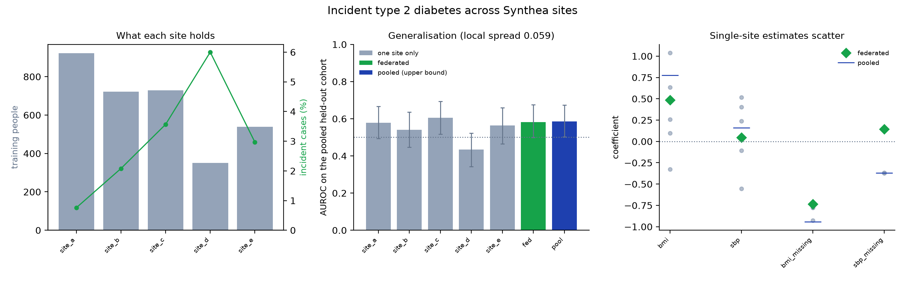

# Federated diabetes risk on Synthea, where there is signal

UK Biobank's synthetic extract draws every field independently, so nothing beats chance on it.
Synthea models disease progression, and `cohort_2` has per-site population parameters, so its five sites differ.

`run.py` and `figures.py` live in [`../ukb_diabetes`](../ukb_diabetes) and take the sites as an argument.

```bash
cd ../ukb_diabetes
python run.py --sites ../../synthea_cohorts/cohort_2/data/omop --job synthea_fedavg --tag synthea
python figures.py --results results_synthea.json --out ../synthea_diabetes/federated_vs_local.png \
  --title "Incident type 2 diabetes across Synthea sites"
```



| model | AUROC | 95% CI |
| --- | --- | --- |
| site_d alone, 350 people | 0.433 | 0.343 to 0.523 |
| site_b alone | 0.541 | 0.447 to 0.635 |
| site_e alone | 0.563 | 0.465 to 0.659 |
| site_a alone | 0.578 | 0.493 to 0.666 |
| site_c alone | 0.606 | 0.518 to 0.694 |
| federated | 0.582 | 0.499 to 0.675 |
| pooled | 0.586 | 0.503 to 0.674 |

FedAvg recovers the pooled model without any site sharing a row.
The smallest site would have done worse than chance alone.

With 23 positives held out the intervals overlap heavily.
They support federated matching pooled and beating the weakest site, not a significant pairwise gap.
