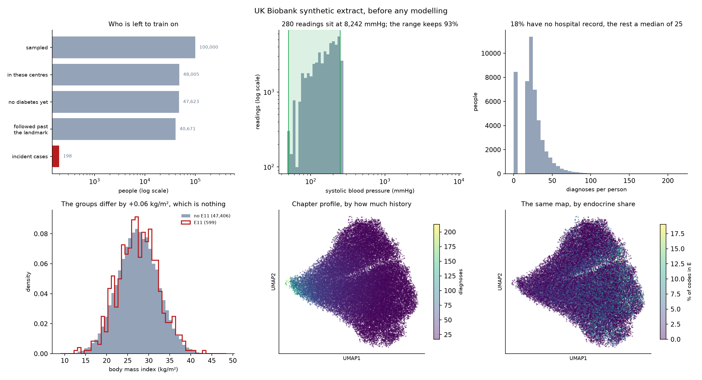

# Raw UK Biobank to federated diabetes risk

The official UK Biobank synthetic tabular extract goes in, OMOP comes out, and NVFlare trains an incident type 2 diabetes model across assessment centres without moving a row of patient data.

```bash
python ../../ukb_omop_agent/ukb/sample_ukb_fields.py --rows 100000 \
  --output ../../ukb_omop_agent/ukb/data/ukb_sampled   # raw UKB, ~2.7 GB
python prepare.py        # one raw folder per assessment centre, still in UKB's wide layout
python to_omop.py        # raw -> OMOP, mapped and validated by the omop-etl skill
python explore.py        # what the source holds, with ehrapy
python run.py            # omopflare + NVFlare FedAvg, against local and pooled references
python figures.py
```



## Steps

`prepare.py` splits people by assessment centre (field 54).
That gives real sites, where `omop_skill/scripts/split_sites.py` would split on `person_id % n`.
The wide UKB layout is left alone so the mapping does the reshaping.

`to_omop.py` runs the `omop-etl` skill with `omop_skill/mappings/ukb_pilot.yaml` and validates every site against the contract.
All eight pass.
That mapping was written independently of this example and reproduces the same row counts.

`explore.py` loads the participants as an `EHRData`, reports `ehrapy.preprocessing.qc_metrics`, and draws the six panels above.
It reads the raw per-centre files, because the mapping keeps only the two measurements and the one condition the study needs.

`run.py` negotiates a feature spec with `omopflare`, standardises with a scaler built from counts and sums each site releases, then fits one model per site, one federated with NVFlare FedAvg, and one pooled.
All three see the same training people, the same scaler, the same held-out people and the same number of passes.

## Mapping decisions

Every ICD-10 code starting `E11` maps to concept 201826, type 2 diabetes mellitus.
The contract permits only that concept, so the subtypes roll up to their parent rather than to the more specific SNOMED concepts a full Athena vocabulary would offer.

Array slot 0 of field 41270 has no matching slot in field 41280, so those 82,045 codes have no date and the mapping's inner join drops them.

The observation period spans every date UKB records for a person, including diagnoses outside the study's concept scope.
Deriving it from `condition_occurrence` instead ends most people's period on their assessment day, and a landmark after the assessment then keeps only the people who have diabetes.

## Cohort

The landmark is the day after the first assessment, so that assessment's measurements sit inside the lookback window and nothing is read on or after the landmark.
People diagnosed before the landmark are prevalent cases and leave.
People whose record ends at the landmark leave too, because an incident diagnosis cannot be observed without follow-up.
That leaves 40,671 people across eight centres, 198 of them incident cases.

## What this data can and cannot show

UK Biobank generates each field of the synthetic dataset independently, and the data confirms it.
Mean BMI is 27.42 in the diabetic group and 27.52 in the rest, sex 0.308 against 0.310, birth year 1952.7 against 1953.1.
No model can beat chance here, and none does.

That makes this a negative control.
Every AUROC interval covers 0.5, and `omopflare`'s leakage report finds nothing: per-feature AUROCs are 0.500 to 0.503.
Single sites still report apparent signal, which is the point.
The eight per-centre models score 0.430 to 0.575 on the same held-out cohort while the federated model scores 0.511, and single-site BMI coefficients run from -0.41 to +0.65 against a federated 0.05 and a pooled 0.02.
Refit on another split those numbers move, as fitting noise should.

The overview says the same before any model runs.
BMI differs by +0.06 kg/m² between the groups.
Systolic blood pressure runs from 48 to 8,242 mmHg with 280 readings at that maximum, so the plausible range drops 7% of readings as sentinels rather than measurements.
18% of people have no hospital record, and the rest carry a median of 25 diagnoses.

The UMAP embeds each person's share of diagnoses per ICD-10 chapter, for the 39,548 people with at least five codes.
People with long histories converge on the population composition and people with short ones scatter, which is what multinomial sampling noise looks like.
There are no subpopulations because the generator draws codes at random.

For the accuracy claim, [`../synthea_diabetes`](../synthea_diabetes) runs the same scripts on data that has signal.

## Limits

Demographics are not features: `omopflare` extracts concepts, and age and sex live in `person`, so this model sees BMI and systolic blood pressure only.
Counts are small, which is why every AUROC carries a bootstrap interval.
