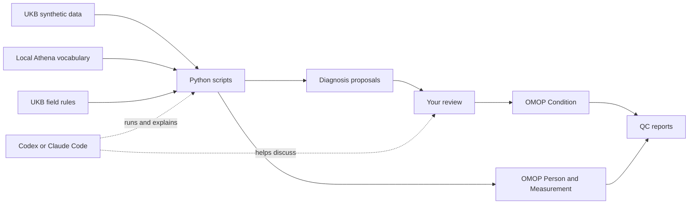

# UKB-to-OMOP mapping agent

`general_agent.py` is the supported UKB-to-OMOP pilot workflow. **Mapping is code-based:** the Python scripts perform the mapping and QC; they do not call an LLM. Core commands use the Python standard library; graphical QC additionally needs Matplotlib.

## How mapping works

For diagnoses, the scripts look up each UKB ICD-10 code in the local Athena vocabulary and show its proposed standard OMOP concepts. **A proposal is not a mapping:** a person chooses which target to approve in `mapping_review.csv`. The scripts then write the reviewed diagnoses to OMOP and check the result. BMI, blood pressure, sex, and birth year follow the predefined UKB field rules in `specs/ukb_pilot_v1.json`; they do not depend on the diagnosis review.



Codex, Claude Code, or another coding assistant with access to this repository can **run the same scripts and discuss their output with you**. For example, ask it to inspect E11, explain the proposed concepts and missing codes, record a specific mapping you approve, and interpret QC. The assistant helps with the conversation; the Python code still checks and applies the mapping. You can also run every command below yourself, without an assistant. For diagnoses beyond E11, see the [general subset options](ukb/README.md).

## Run the UKB workflow

From the repository root, first generate a synthetic UKB input using the bundled [download and processing scripts](ukb/README.md), or set `UKB_TSV` to an existing tab-separated extract with `EID` and the fields declared in `specs/ukb_pilot_v1.json`. **No UKB data is committed to this folder.** The script sequence below downloads the first 10,000 records per official synthetic field-group file and creates an E11-focused subset locally. Set `ATHENA_DIR` to a local Athena vocabulary directory containing tab-separated `CONCEPT.csv`, `CONCEPT_RELATIONSHIP.csv`, and `VOCABULARY.csv` from one release, including ICD10. Athena vocabularies are not bundled. Python 3.9 or newer is required. Choose a fresh run directory each time.

```bash
python3 ukb_omop_agent/ukb/sample_ukb_fields.py \
  --rows 10000 --output ukb_omop_agent/ukb/data/ukb_sampled
python3 ukb_omop_agent/ukb/make_ukb_subset.py \
  --input ukb_omop_agent/ukb/data/ukb_sampled \
  --output ukb_omop_agent/ukb/data/ukb_e11_pilot --all-e11
```

These are **source-preparation steps, not OMOP mapping**. The first command saves the first 10,000 rows from each relevant UKB synthetic field-group file in `ukb_sampled/` and checks that the EIDs line up. The second command scans that sample for participants with at least one diagnosis code beginning `E11` and writes **all** such participants to `ukb_subset.tsv`; `--all-e11` does not impose a limit of 20 or 200 people. Their selected fields, including other diagnosis codes, stay in the TSV. Only the later `--diagnosis-prefix E11` option on `general_agent.py` limits which diagnosis events are inspected and mapped. For example, the source code `E119` (E11.9) is part of the E11 family and gets its own review row. Neither preparation command assigns an OMOP concept.

```bash
export UKB_TSV=ukb_omop_agent/ukb/data/ukb_e11_pilot/ukb_subset.tsv
export ATHENA_DIR=/path/to/athena_vocabulary
export RUN_DIR=ukb_omop_agent/output/my_e11_run

python3 ukb_omop_agent/general_agent.py inspect \
  --input "$UKB_TSV" \
  --spec ukb_omop_agent/specs/ukb_pilot_v1.json \
  --vocabulary "$ATHENA_DIR" \
  --diagnosis-prefix E11 \
  --output "$RUN_DIR"
```

`mapping_review.csv` has one row per source field, vocabulary, and code. The `candidate_targets_json` column lists valid standard targets with their OMOP domains; `candidate_value_ids` lists valid `Maps to value` targets. Inspection **does not approve** anything. Review each mapping, then set `decision=approved`, `approved_target_ids` to one or more semicolon-separated IDs, `mapping_kind=vocabulary_maps_to` or `local_reviewed`, and provide `evidence`. For an Observation or Measurement mapping that needs `Maps to value`, set `approved_value_concept_id` as well. Leave other rows as `needs_review` or `unmapped`. Use a new output directory for each inspection so the review file is not overwritten.

```bash
python3 ukb_omop_agent/general_agent.py apply \
  --input "$UKB_TSV" \
  --spec ukb_omop_agent/specs/ukb_pilot_v1.json \
  --vocabulary "$ATHENA_DIR" \
  --diagnosis-prefix E11 \
  --review "$RUN_DIR/mapping_review.csv" \
  --output "$RUN_DIR/omop"

python3 ukb_omop_agent/general_agent.py qc \
  --input "$UKB_TSV" \
  --spec ukb_omop_agent/specs/ukb_pilot_v1.json \
  --vocabulary "$ATHENA_DIR" \
  --diagnosis-prefix E11 \
  --review "$RUN_DIR/mapping_review.csv" \
  --output "$RUN_DIR/omop"
```

For graphical QC, install the optional plotting dependency in your Python environment:

```bash
python3 -m pip install -r ukb_omop_agent/requirements-qc.txt
python3 ukb_omop_agent/plot_qc.py \
  --run "$RUN_DIR" \
  --omop "$RUN_DIR/omop" \
  --review "$RUN_DIR/mapping_review.csv"
```

This writes `graphical_qc.png`, `graphical_qc.pdf`, `graphical_qc.json`, `mapping_detail.png`, and `mapping_detail.pdf` in the OMOP output directory. It also writes `mapping_inventory.csv` (every selected source code, its Athena candidates, approved targets, counts, and status), `mapped_codes.csv`, `missing_codes.csv`, `field_summary.csv`, and `mapping_inventory_summary.json`. `missing_codes.csv` includes codes with unmapped dated records or source records without valid paired dates; it has only a header if none are missing. Missing reasons distinguish an absent Athena source concept, no standard candidate, pending review, explicit rejection, and a reviewed mapping that failed to write. Use the exact reviewed CSV used at apply time, because the plotting command verifies its hash.

**The "Selected source record coverage" chart counts selected diagnoses only.** BMI and blood-pressure mappings are counted separately in the field summary; sex and birth year populate Person. For the UKB pilot, numeric QC flags BMI outside 10–80 kg/m² and systolic blood pressure outside 60–250 mmHg; these are QC ranges, not clinical diagnoses.

To refresh only the detailed CSV and JSON inventory from an existing applied run, without replotting:

```bash
python3 ukb_omop_agent/mapping_inventory.py \
  --run "$RUN_DIR" \
  --omop "$RUN_DIR/omop" \
  --review "$RUN_DIR/mapping_review.csv"
```

The UKB specification declares sex, birth year, BMI, systolic blood pressure, ICD10 diagnoses, units, and date pairings. BMI, blood pressure, sex, and units are documented local rules in the specification; their concept IDs are checked against Athena. ICD10 codes are matched to source concepts by case-insensitive equality after removing decimal points, then followed through active `Maps to` and `Maps to value` relationships. Targets are **proposals** until approved. A source event with multiple approved targets creates multiple OMOP rows. Source codes and source concept IDs are retained where available.

### Select diagnoses

Add `--diagnosis-code E110` for one exact ICD10 code (equivalent to `E11.0`), or `--diagnosis-prefix E11` for the E11 family. `--diagnosis-code E11` would match only a literal `E11` source code, not `E110` through `E119`. Repeat either flag to select more codes or families; selections are combined. Use **the same flags** on `inspect`, `apply`, and `qc`. The preflight records the selection and rejects a later apply/QC run with different flags. This diagnosis-event filter is separate from `make_ukb_subset.py --all-e11`, which selects participants. People and non-diagnosis measurements remain in the OMOP output. Without either diagnosis flag, every ICD10 diagnosis in the input is considered.

The output is a **pilot subset** of OMOP 5.4 tables: person, observation_period, condition_occurrence, measurement, observation, and procedure_occurrence. Unapproved source events remain with concept ID 0 in the configured fallback domain. The QC checks exact replay, unique row IDs, and person foreign keys. It also reports input events, mapped events by field, exclusions, and unknown units. Coverage and replay QC do not establish clinical correctness.

## Other source layouts

`specs/flat_events_example_v1.json` shows the second adapter. It reads a row-per-event CSV with patient ID, demographics, source field, event kind (`coded` or `numeric`), vocabulary, code, date, numeric value, and unit. Copy the spec and change its column names and unit map to match a new source. The same inspect, apply, and QC commands then work with that input. The UKB-specific field numbers and rules stay only in `ukb_pilot_v1.json`.

## Boundaries

The agent currently writes Condition, Measurement, Observation, and Procedure events. Other target domains fail explicitly during apply; add a domain writer before approving them. Output tables have pilot columns, not every column of a deployable OMOP CDM database. The technical observation period spans dated events and is not verified enrollment. Type concepts remain 0 unless declared in a source spec. The same Athena release should be used for inspection and application.

```bash
python3 -m unittest discover -s ukb_omop_agent/tests
```
